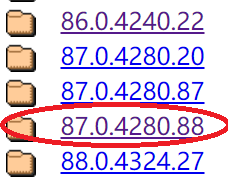

# Video
https://youtu.be/mmLCft_PF-Q

# Installation

System: Ubuntu 18.04 system

1. Basic setup (pip3, git, Chromium)
   
   ```shell
   sudo apt install python3-pip
   sudo apt install git
   sudo apt-get install chromium-browser
   ```
   
   You can also use Firefox or Chrome browser. But you have to install a normal browser before you install the webdriver.
   
2. Install mitmproxy
   
   ```shell
    pip3 install --user mitmproxy
   ```
   
   The --user option is essential.
   
   Run `mitmproxy` in terminal. Default listening port is 8080.
   
   
   
3. Install selenium and webdriver

    (1) Check your browser's version

    

    (2) If you're using Chrome or Chromium, you can download [chromedriver](https://chromedriver.storage.googleapis.com/index.html). Firefox users can download [geckodrive](https://github.com/mozilla/geckodriver/releases).

    Download the webdriver with the closest version to your browser.

    

    (3) Extract and move the chormedriver to `/usr/bin`

    (4) Install selenium with pip3

    ```sh
    pip3 install selenium
    ```

    (5) Try to run the following python program. If open the browser, it should be successful.

    ```python
    from selenium import webdriver
    
    webdriver.Chrome()
    
    # webdriver.Firefox()
    ```

    

4. Run webdriver with mitmproxy opened. This program is available in our project at `setup/install_test.py`.

    ```python
    from selenium.webdriver.chrome.options import Options
    
    from selenium import webdriver
    
    chrome_options = Options()
    
    chrome_options.add_argument('--proxy-server=' + "127.0.0.1:8080")
    
    driver = webdriver.Chrome(chrome_options=chrome_options)
    
    driver.get("https://google.com")
    ```

    

5. Certificate and HTTPS

    To solve the problem above and let mitmproxy relay HTTPS message, we need to let the browser trust the certificate of mitmproxy.

    With browser connected to mitmproxy (just hold the state in the above picture), open [mitm.it](mitm.it) in browser and download the certificate （**.pem** file) for your system. Click "Show Instructions" to see how to let your system trust the certificate. **In my case, the instructions didn't really solve the problem, so I use the following method to manually import the certificate to Chrome.** Similar things have to be done for firefox.

    

    Go to [chrome://settings/certificates](chrome://settings/certificates), import the **.pem** file under **Authorities** section. 

    

    Run our program again, you will find that works.

    

# Run our project

1. Download our project

   ```shell
   git clone git@github.com:baigd/moscan.git
   ```

2. Run `setup/mkdir.sh` to create directories.

3. Set your terminal path under the `scripts` in our project.

   ```shell
   mitmproxy -s "main.py" --listen-port 8080
   mitmproxy -s "main.py" --listen-port 8081
   ```

   Run these two commands in different tabs in terminal. The ports should be different and can be other ports you like.

   Later we can see logs of different mitmproxy under `scripts/log`.

4. Run `scripts/open_browser.py` 

   Two browsers will be opened. Open twitter or facebook and log into different accounts for test in two browsers.

   Install [ModHeader](https://chrome.google.com/webstore/detail/modheader/idgpnmonknjnojddfkpgkljpfnnfcklj/related?hl=en) in one of the browser. Input a special string in ModHeader, so that we can distinguish the two browsers by the special string in their HTTP headers. Here I set the string as "longming". And this value is written in our code so please use this value for test.

   

5. Restart all browsers and mitmproxy.

   Simply close the browsers and press q in mitmproxy to exit.

   Run the two mitmproxy and `scripts/open_browser.py` again.

   The browser will automatically open https://theonion.com/. Try to log in with twitter using the browser with special headers that we set before. This browser's login process will be killed and blocked at the state as the right browser in the picture below. And then try to log in with twitter in the other browser. The result will be similar to the left browser below. 

   Because we turn on the CSRF attack in our scripts. The `state` parameter in login process of the right browser will be captured and stored in file with name `state=` under`scripts/RAM`. The `state` parameter of the left browser will be substituted with the value we store in  `state=` before. Because https://theonion.com/ checks the integrity of the `state` parameter, this attack is detected and responsed with "Access denied".

   

6. Explanation

   Go to `scripts/log` to check the latest two log files. Here is an example of the log in my test following the previous instructions.

   We can see from the picture below, mitmproxy listens to the HTTP messages from the browser with ModHeader. It can detect which state is going on in the login process. It captures and stores the `state` parameter, and then kills the flow.

   

   The picture below is the log of the other mitmproxy listening to the other browser. We can see it also detect states in login process. It substitutes the original `state` parameter with the one we captured in the other mitmproxy.

   

   The state numbers in the log represent state in our state machine. The meaning of each state is listed below.

   state
   0: Before start
   1: detect the RP website's message
   2: detect the IdP website's message for authorization
   3: detect the RP website's message again
   4: log in successfully
   5: timeout

7. Some settings of our scripts.

   You can put testing RP into `scripts/checker.py`

   

   You can change the testing IdP in `scripts/main.py`

   

If you want to do other CSRF attacks, you can change the code in the CSRF part of `scripts/main.py`. We have realized most common parameter substitution methods for SSO testing.


You can add your username into our code, so that we can detect if the login succeed.


